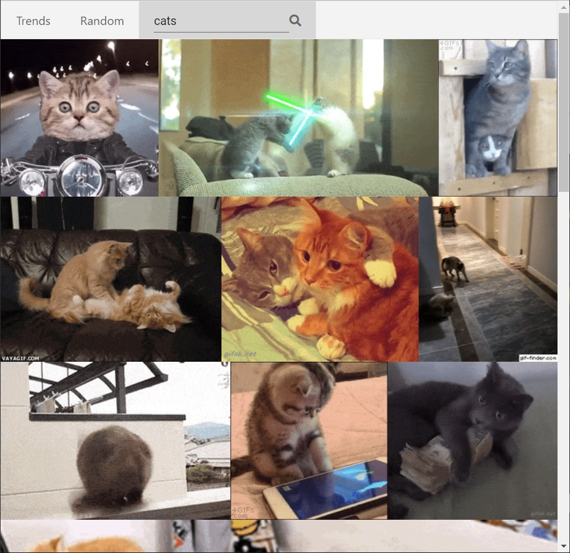

GYPHY
=========================

=========================
Used technologies:
[fetch API](https://developer.mozilla.org/ru/docs/Web/API/Fetch_API),
[React-hooks](https://ru.reactjs.org/docs/hooks-intro.html),
[prop-types](https://ru.reactjs.org/docs/typechecking-with-proptypes.html).

All images taken from [GIPHY](https://giphy.com/).
For the application to work, you need to get the giphy API key.
Paste key to `api/config.js`.

## Available Scripts

In the project directory, you can run:

### `npm start`

Runs the app in the development mode. 
Open [http://localhost:3000](http://localhost:3000) to view it in the browser.

The page will reload if you make edits. 
You will also see any lint errors in the console.

### `npm run api`
### `npm run api:inspect`

Launches API for the application to work.
Api can work in the Docker container.
For use this need set environment `PORT` and `API_KEY`.

### `npm run build`

Builds the app for production to the `build` folder. 
